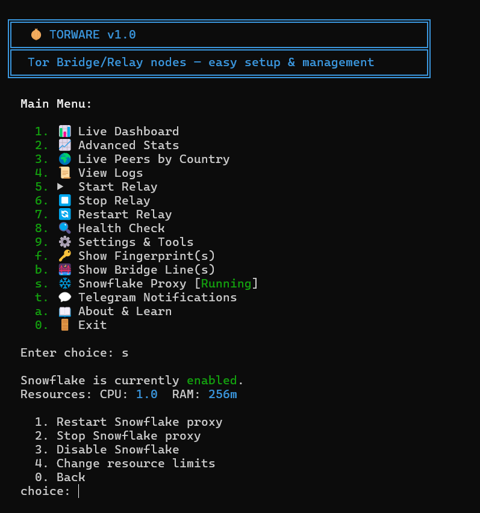
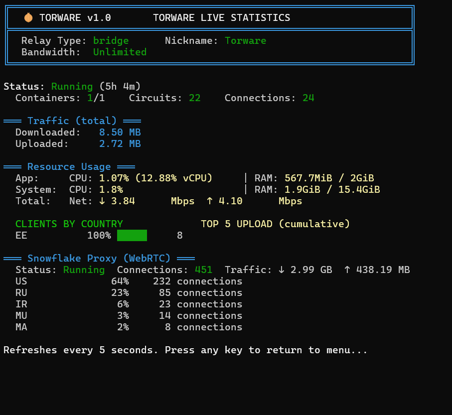
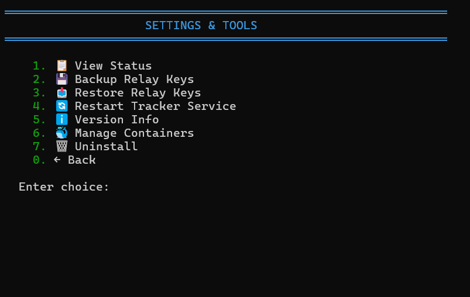

# Torware

One-click Tor Bridge/Relay node setup and management tool with live TUI dashboard, Snowflake proxy support, and Telegram notifications.


## Screenshots

| Main Menu | Live Dashboard | Settings |
|:---------:|:--------------:|:--------:|
|  |  |  |

## Quick Install

```bash
curl -sL https://raw.githubusercontent.com/SamNet-dev/torware/main/torware.sh | sudo bash
```

That's it. The installer will:
- Detect your OS (Ubuntu, Debian, Fedora, CentOS, Arch, Alpine, etc.)
- Install Docker if not already present
- Walk you through an interactive setup wizard
- Start your Tor relay in Docker with auto-restart on boot

## Features

### Relay Types
- **Bridge (obfs4)** — Hidden entry point for censored users. IP not publicly listed. Safest option. *(Default)*
- **Middle Relay** — Routes encrypted traffic within the Tor network. IP is publicly listed but no exit traffic.
- **Exit Relay** — Final hop to the internet. Requires understanding of legal implications. Full warning and confirmation during setup.

### Live TUI Dashboard
Real-time terminal dashboard with 5-second refresh:
- Active circuits and connections
- Bandwidth (download/upload) with totals
- CPU and RAM usage per container and system-wide
- Client countries (24-hour unique clients for bridges)
- Data cap usage (if configured)
- Snowflake proxy stats

### Snowflake WebRTC Proxy
Run a Snowflake proxy alongside your relay to help censored users connect via WebRTC:
- No port forwarding needed (WebRTC handles NAT traversal)
- Configurable CPU and memory limits
- Live connection and traffic stats on the dashboard
- Independent start/stop from the main relay

### Multi-Container Support
Run up to 5 Tor containers simultaneously:
- Each container gets unique ORPort and ControlPort
- Per-container bandwidth, relay type, and resource limits
- Mixed relay types (e.g., container 1 = bridge, container 2 = middle)
- Add/remove containers from the management menu

### Telegram Notifications
- Setup wizard with guided BotFather integration
- Periodic status reports (configurable interval + start hour)
- Bot commands: `/tor_status`, `/tor_peers`, `/tor_uptime`, `/tor_containers`, `/tor_snowflake`, `/tor_start_N`, `/tor_stop_N`, `/tor_restart_N`, `/tor_help`
- Alerts for high CPU, high RAM, all containers down, or zero connections
- Daily and weekly summary reports
- Uses `/tor_` prefix so the bot can be shared with other services

### Background Traffic Tracker
- ControlPort event subscription for real-time bandwidth and circuit data
- Country-level traffic aggregation via GeoIP
- Cumulative statistics persisted to disk
- Runs as a systemd service (or OpenRC/SysVinit)

### Health Check
15-point diagnostic covering:
- Docker daemon status
- Container state and restart count
- ControlPort connectivity and cookie authentication
- Data volume integrity
- Network mode verification
- Relay fingerprint validation
- Snowflake proxy and metrics endpoint
- GeoIP and system tool availability

### About & Learn
Built-in educational section covering:
- What is Tor and how it works
- Bridge, Middle, and Exit relay explanations
- Snowflake proxy details
- How Tor circuits work (with ASCII diagram)
- Dashboard metrics explained
- Legal and safety considerations
- Port forwarding guide for home users

## CLI Commands

```
torware start           Start all relay containers
torware stop            Stop all relay containers
torware restart         Restart all relay containers
torware status          Show relay status summary
torware dashboard       Open live TUI dashboard
torware stats           Open advanced statistics
torware peers           Show live peers by country
torware logs            View container logs
torware health          Run health check
torware fingerprint     Show relay fingerprint(s)
torware bridge-line     Show bridge line(s) for sharing
torware snowflake       Snowflake proxy management
torware backup          Backup Tor identity keys
torware restore         Restore from backup
torware uninstall       Remove Torware and containers
torware menu            Open interactive menu
torware help            Show help
torware version         Show version
```

Or just run `torware` with no arguments to open the interactive menu.

## Requirements

- **OS**: Linux (Ubuntu, Debian, Fedora, CentOS, RHEL, Arch, Alpine, openSUSE, Raspbian)
- **RAM**: 512 MB minimum (1 GB+ recommended for multiple containers)
- **Docker**: Installed automatically if not present
- **Ports**: 9001 TCP (ORPort), 9002 TCP (obfs4) — must be forwarded if behind NAT
- **Root**: Required for Docker and system service management

## Port Forwarding (Home Users)

If running from home behind a router, you must forward these ports:

| Port | Protocol | Purpose |
|------|----------|---------|
| 9001 | TCP | Tor ORPort |
| 9002 | TCP | obfs4 pluggable transport |

Log into your router (usually `192.168.1.1` or `10.0.0.1`), find **Port Forwarding**, and add both TCP forwards to your server's local IP.

Snowflake does **not** need port forwarding — WebRTC handles NAT traversal automatically.

## Docker Images

| Relay Type | Image |
|------------|-------|
| Bridge (obfs4) | `thetorproject/obfs4-bridge:latest` |
| Middle/Exit Relay | `osminogin/tor-simple:latest` |
| Snowflake Proxy | `thetorproject/snowflake-proxy:latest` |

## File Structure

```
/opt/torware/
├── settings.conf              # Configuration
├── torware                    # Management script (symlinked to /usr/local/bin/torware)
├── torware-tracker.sh         # Background ControlPort monitor
├── backups/                   # Tor identity key backups
├── relay_stats/               # Tracker data
│   ├── cumulative_data        # Country|InBytes|OutBytes
│   ├── cumulative_ips         # Country|IP
│   ├── tracker_snapshot       # Real-time 15s window
│   └── geoip_cache            # IP to Country cache
└── containers/                # Per-container torrc files
    ├── relay-1/torrc
    ├── relay-2/torrc
    └── ...
```

## Configuration

All settings are stored in `/opt/torware/settings.conf` and can be changed via the Settings menu or by editing the file directly.

Key settings:
- `RELAY_TYPE` — bridge, middle, or exit
- `NICKNAME` — your relay's nickname on the Tor network
- `CONTACT_EMAIL` — contact for directory authorities
- `BANDWIDTH` — bandwidth rate limit (Mbit/s)
- `CONTAINER_COUNT` — number of Tor containers (1-5)
- `DATA_CAP` — monthly data cap (GB), 0 for unlimited
- `SNOWFLAKE_ENABLED` — true/false
- `SNOWFLAKE_CPUS` / `SNOWFLAKE_MEMORY` — Snowflake resource limits

Per-container overrides: `RELAY_TYPE_N`, `BANDWIDTH_N`, `ORPORT_N` (where N is the container index).

## Uninstall

```bash
sudo torware uninstall
```

This will stop and remove containers, remove systemd services, and optionally delete configuration and backups.

## Contributing

Contributions are welcome. Please open an issue or pull request on GitHub.

## License

This project is licensed under the MIT License. See [LICENSE](LICENSE) for details.

## Acknowledgments

- [The Tor Project](https://www.torproject.org/) for building and maintaining the Tor network
- [Snowflake](https://snowflake.torproject.org/) for the WebRTC pluggable transport
- All Tor relay operators who keep the network running

---

<div dir="rtl">

## فارسی

### تورویر (Torware) چیست؟

تورویر یک ابزار خط فرمان برای راه‌اندازی و مدیریت نودهای شبکه تور (Tor) است. با یک دستور ساده، می‌توانید یک بریج (Bridge)، رله میانی (Middle Relay) یا رله خروجی (Exit Relay) تور را روی سرور خود راه‌اندازی کنید.

### نصب سریع

<div dir="ltr">

```bash
curl -sL https://raw.githubusercontent.com/SamNet-dev/torware/main/torware.sh | sudo bash
```

</div>

### انواع رله

- **بریج (Bridge)** — نقطه ورود مخفی برای کاربرانی که در کشورهای سانسورشده هستند. آدرس IP شما عمومی نمی‌شود. **امن‌ترین گزینه.** (پیش‌فرض)
- **رله میانی (Middle Relay)** — ترافیک رمزنگاری‌شده را در شبکه تور مسیریابی می‌کند. آدرس IP شما عمومی است اما ترافیک خروجی ندارید.
- **رله خروجی (Exit Relay)** — آخرین گام به اینترنت. نیاز به درک مسائل حقوقی دارد.

### ویژگی‌ها

- **داشبورد زنده** — نمایش لحظه‌ای مدارها، پهنای باند، مصرف CPU/RAM و کشور کاربران
- **پروکسی اسنوفلیک (Snowflake)** — کمک به کاربران سانسورشده از طریق WebRTC بدون نیاز به Port Forwarding
- **چند کانتینر** — تا ۵ کانتینر تور همزمان با انواع مختلف رله
- **اعلان‌های تلگرام** — گزارش وضعیت خودکار و دستورات ربات
- **بررسی سلامت** — ۱۵ نقطه تشخیصی برای اطمینان از عملکرد صحیح
- **آموزش داخلی** — توضیح کامل شبکه تور، انواع رله‌ها و مسائل حقوقی

### پیش‌نیازها

- **سیستم‌عامل**: لینوکس (اوبونتو، دبیان، فدورا، سنت‌اواس، آرچ، آلپاین و...)
- **رم**: حداقل ۵۱۲ مگابایت (۱ گیگابایت یا بیشتر توصیه می‌شود)
- **داکر**: در صورت نبودن، به صورت خودکار نصب می‌شود
- **پورت‌ها**: 9001 TCP و 9002 TCP — اگر پشت NAT هستید باید Port Forward کنید

### Port Forwarding (کاربران خانگی)

اگر از خانه و پشت روتر اجرا می‌کنید، باید این پورت‌ها را Forward کنید:

| پورت | پروتکل | کاربرد |
|------|---------|--------|
| 9001 | TCP | پورت اصلی تور (ORPort) |
| 9002 | TCP | انتقال obfs4 |

وارد تنظیمات روتر شوید (معمولا `192.168.1.1` یا `10.0.0.1`)، بخش **Port Forwarding** را پیدا کنید و هر دو پورت TCP را به IP محلی سرور خود Forward کنید.

اسنوفلیک نیازی به Port Forwarding **ندارد** — WebRTC به صورت خودکار از NAT عبور می‌کند.

### خط بریج (Bridge Line)

بعد از راه‌اندازی، خط بریج شما ممکن است چند ساعت تا ۱-۲ روز طول بکشد تا در دسترس قرار بگیرد. تور باید مراحل زیر را طی کند:
1. بوت‌استرپ کامل و تست دسترسی ORPort
2. انتشار توصیفگر به مرجع بریج
3. اضافه شدن به BridgeDB برای توزیع

می‌توانید پیشرفت را با گزینه **Health Check** (شماره ۸ در منو) بررسی کنید.

### چرا بریج اجرا کنیم؟

میلیون‌ها نفر در کشورهایی مانند ایران، چین، روسیه و بسیاری دیگر از کشورها، به دلیل سانسور اینترنت قادر به دسترسی آزاد به اطلاعات نیستند. با اجرای یک بریج تور، شما به این افراد کمک می‌کنید تا:

- به اینترنت آزاد دسترسی پیدا کنند
- اخبار واقعی را بخوانند
- با خانواده و دوستان خود در خارج از کشور ارتباط برقرار کنند
- از حریم خصوصی خود محافظت کنند

**هر بریج مهم است.** حتی یک بریج کوچک با پهنای باند محدود می‌تواند به ده‌ها نفر کمک کند.

### مجوز

این پروژه تحت مجوز MIT منتشر شده است. فایل [LICENSE](LICENSE) را ببینید.

</div>
